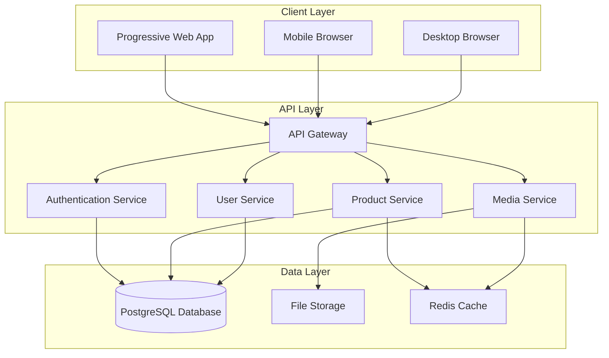

# Turgus Design Document

## Overview

Turgus is a mobile-first, bilingual marketplace platform built as a Progressive Web Application (PWA). The system enables a single seller ("Bazar dos BUts") to showcase products through a photo-centric workflow, while providing buyers with an Instagram-like browsing experience. The architecture prioritizes mobile performance, responsive design, and seamless user interactions.

## Architecture

### High-Level Architecture



### Technology Stack

**Frontend:**
- React 18 with TypeScript
- Vite for build tooling
- PWA capabilities with service workers
- Tailwind CSS for responsive design
- React Query for state management and caching
- React Router for navigation
- i18next for internationalization

**Backend:**
- Node.js with Express.js
- TypeScript
- JWT for authentication
- Multer for file uploads
- Sharp for image processing

**Database:**
- PostgreSQL for relational data
- Redis for caching and sessions

**Infrastructure:**
- File storage for images (local/cloud)
- Image CDN for optimized delivery

## Components and Interfaces

### Frontend Components

#### Core Layout Components
- `AppShell`: Main application wrapper with navigation
- `MobileNavigation`: Bottom navigation for mobile
- `LanguageToggle`: Portuguese/English switcher
- `AuthGuard`: Route protection component

#### Seller Components
- `PhotoUploader`: Bulk photo upload interface
- `PhotoSelector`: Multi-select photo grid
- `ProductForm`: Product details form
- `ProductManager`: Seller dashboard
- `OrderManager`: Want list management

#### Buyer Components
- `ProductFeed`: Instagram-like product grid
- `ProductCard`: Individual product display
- `ProductDetail`: Full product view with gallery
- `FilterBar`: Category and status filters
- `WantList`: Buyer's selected products
- `UserRegistration`: Buyer account creation

#### Shared Components
- `ImageGallery`: Multi-photo viewer with swipe
- `LoadingSpinner`: Loading states
- `ErrorBoundary`: Error handling
- `Toast`: Notifications

### API Interfaces

#### Authentication Endpoints
```typescript
POST /api/auth/seller/login
POST /api/auth/buyer/register
POST /api/auth/buyer/login
POST /api/auth/logout
GET /api/auth/me
```

#### Product Endpoints
```typescript
GET /api/products              // Get products with filters
GET /api/products/:id          // Get single product
POST /api/products             // Create product (seller only)
PUT /api/products/:id          // Update product (seller only)
DELETE /api/products/:id       // Delete product (seller only)
POST /api/products/:id/publish // Publish product (seller only)
```

#### Media Endpoints
```typescript
POST /api/media/upload         // Upload multiple photos
GET /api/media/:id             // Get optimized image
DELETE /api/media/:id          // Delete photo (seller only)
```

#### Want List Endpoints
```typescript
GET /api/want-lists            // Get buyer's want list
POST /api/want-lists/items     // Add product to want list
DELETE /api/want-lists/items/:id // Remove from want list
GET /api/seller/want-lists     // Get all want lists (seller only)
DELETE /api/seller/want-lists/:id // Cancel want list (seller only)
```

## Data Models

### User Models

```typescript
interface SellerAccount {
  id: string;
  username: string; // "Bazar dos BUts"
  passwordHash: string;
  createdAt: Date;
  updatedAt: Date;
}

interface BuyerAccount {
  id: string;
  name: string;
  telephone: string;
  address: string;
  email?: string;
  passwordHash: string;
  language: 'pt' | 'en';
  createdAt: Date;
  updatedAt: Date;
}
```

### Product Models

```typescript
interface Product {
  id: string;
  title: string;
  description: string;
  price: number;
  categories: string[];
  status: 'draft' | 'available' | 'reserved' | 'sold';
  sellerId: string;
  createdAt: Date;
  updatedAt: Date;
  publishedAt?: Date;
}

interface ProductPhoto {
  id: string;
  productId: string;
  filename: string;
  originalName: string;
  mimeType: string;
  size: number;
  order: number;
  createdAt: Date;
}

interface ProductView {
  id: string;
  productId: string;
  buyerId: string;
  viewedAt: Date;
}
```

### Want List Models

```typescript
interface WantList {
  id: string;
  buyerId: string;
  status: 'active' | 'completed' | 'cancelled';
  createdAt: Date;
  updatedAt: Date;
}

interface WantListItem {
  id: string;
  wantListId: string;
  productId: string;
  addedAt: Date;
}
```

### Category Model

```typescript
interface Category {
  id: string;
  name: string;
  nameEn: string;
  namePt: string;
  createdAt: Date;
}
```

## Mobile-First Design Considerations

### Responsive Breakpoints
- Mobile: 320px - 768px (primary focus)
- Tablet: 768px - 1024px
- Desktop: 1024px+

### Touch Interactions
- Minimum touch target size: 44px
- Swipe gestures for photo galleries
- Pull-to-refresh on product feed
- Long press for multi-select

### Performance Optimizations
- Image lazy loading with intersection observer
- Virtual scrolling for large product lists
- Progressive image loading (blur-up technique)
- Service worker caching for offline functionality
- Optimized bundle splitting

### Mobile UX Patterns
- Bottom navigation for primary actions
- Floating action button for "Add Product"
- Modal overlays for forms
- Infinite scroll for product feed
- Haptic feedback for interactions (where supported)

## Error Handling

### Frontend Error Handling
- Global error boundary for React errors
- Network error retry mechanisms
- Offline state detection and messaging
- Form validation with real-time feedback
- Toast notifications for user feedback

### Backend Error Handling
- Structured error responses with codes
- Request validation middleware
- File upload error handling
- Database transaction rollbacks
- Rate limiting protection

### Error Response Format
```typescript
interface ErrorResponse {
  error: {
    code: string;
    message: string;
    details?: any;
  };
  timestamp: string;
  path: string;
}
```

## Testing Strategy

### Frontend Testing
- Unit tests for utility functions and hooks
- Component testing with React Testing Library
- Integration tests for user workflows
- Visual regression testing for responsive design
- Performance testing with Lighthouse

### Backend Testing
- Unit tests for business logic
- Integration tests for API endpoints
- Database integration tests
- File upload testing
- Authentication flow testing

### End-to-End Testing
- Critical user journeys (seller product creation, buyer purchase flow)
- Cross-browser compatibility testing
- Mobile device testing on real devices
- Performance testing under load

## Security Considerations

### Authentication & Authorization
- JWT tokens with short expiration
- Secure password hashing (bcrypt)
- Role-based access control (seller vs buyer)
- Session management with Redis

### Data Protection
- Input validation and sanitization
- SQL injection prevention with parameterized queries
- XSS protection with Content Security Policy
- File upload restrictions (type, size, scanning)

### API Security
- Rate limiting per user/IP
- CORS configuration
- Request size limits
- HTTPS enforcement

## Internationalization

### Language Support
- Portuguese (default)
- English
- Dynamic language switching
- Persistent language preference

### Implementation
- i18next for React components
- Namespace organization by feature
- Pluralization support
- Date/number formatting by locale

### Content Structure
```typescript
interface TranslationKeys {
  common: {
    buttons: { save: string; cancel: string; };
    navigation: { products: string; profile: string; };
  };
  seller: {
    upload: { title: string; instructions: string; };
    product: { form: { title: string; description: string; }; };
  };
  buyer: {
    feed: { filters: string; sort: string; };
    product: { wantThis: string; comments: string; };
  };
}
```

## Performance Requirements

### Loading Performance
- First Contentful Paint: < 1.5s on 3G
- Largest Contentful Paint: < 2.5s on 3G
- Time to Interactive: < 3.5s on 3G

### Image Optimization
- WebP format with JPEG fallback
- Multiple sizes for responsive images
- Lazy loading below the fold
- Progressive JPEG for large images

### Caching Strategy
- Service worker caching for static assets
- Redis caching for frequently accessed data
- Browser caching headers
- CDN caching for images

## Deployment Architecture

### Google Cloud Platform (GCP) Infrastructure

**Compute Services:**
- Cloud Run for containerized backend services
- Cloud Storage for static assets and image files
- Cloud SQL (PostgreSQL) for database
- Memorystore (Redis) for caching and sessions

**Networking & Security:**
- Cloud Load Balancer for traffic distribution
- Cloud CDN for global image delivery
- Cloud Armor for DDoS protection
- Identity and Access Management (IAM) for service security

**Development & Operations:**
- Cloud Build for CI/CD pipelines
- Container Registry for Docker images
- Cloud Monitoring for application observability
- Cloud Logging for centralized logs

### Environment Setup
- **Development:** Local with hot reload
- **Staging:** GCP Cloud Run with staging database
- **Production:** Multi-region GCP deployment with monitoring

### CI/CD Pipeline (Cloud Build)
- Automated testing on pull requests
- Docker image building and pushing to Container Registry
- Automated deployment to Cloud Run
- Database migration management with Cloud SQL
- Image optimization pipeline with Cloud Functions

### Monitoring & Observability
- Cloud Monitoring for performance metrics
- Cloud Logging for error tracking and debugging
- Cloud Trace for request tracing
- Custom dashboards for business metrics